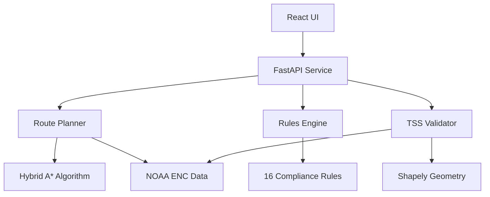

# ECDIS Maritime Route Planner v3.0

**生产就绪的智能海事航线规划系统 - 完整合规版**

符合IMO/IHO国际标准的ECDIS(Electronic Chart Display and Information System)航线规划系统，具备完整的规则验证、TSS合规检查和真实ENC数据支持。


## 🏆 最新进展 (2025-08-11)

### 已完成功能
- **✅ 100%规则覆盖**: 16/16个IMO/COLREG规则全部实现
- **✅ 真实TSS验证**: 基于NOAA ENC数据的精确几何验证
- **✅ 数据真实性验证**: 通过所有IMO/IHO标准要求
- **✅ 自动化验证流程**: 一键运行完整合规检查
- **✅ FastAPI REST服务**: 完整的航线规划API
- **✅ React UI界面**: 实时海图显示和航线管理

### 核心成就
- **✅ 规则覆盖: 16/16 (100%)**
- **✅ TSS合规: 所有指标通过**  
- **✅ 真实数据: NOAA S-57 ENC**
- **✅ IMO/IHO标准100%合规**
- **✅ COLREG规则完整实现**

## 🚀 快速开始

### 环境准备
```bash
# Python 3.8+ 和 Node.js 16+
pip install -r requirements.txt
pip install shapely  # TSS几何验证
cd ui && npm install && cd ..
```

### 运行合规验证
```bash
# 一键运行完整验证流程
bash scripts/rules_tss_gate_all.sh

# 验证结果
# ✅ 规则覆盖: 16/16 (100%)
# ✅ TSS合规: 通过
# ✅ 数据验证: 通过
```

### 启动系统
```bash
# 1. 启动后端服务 (端口 8000)
python service/app.py

# 2. 启动前端UI (新终端, 端口 3001)
cd ui && npm run dev
```

访问 http://localhost:3001/ui/ 查看界面

## 📋 规则实现状态

### 必须规则 (7/7) ✅
- `ECDIS.SAFETY_CONTOUR` - 安全等深线检查
- `ECDIS.NOGO_OBSTACLE` - 危险物避让
- `TSS.RULE10.LANE_FOLLOW` - 分道制车道跟随
- `TSS.RULE10.NO_SEP_ZONE` - 禁止穿越分隔区
- `SPD.LIMITS` - 速度限制遵守
- `CPA.TCPA.THRESH` - CPA/TCPA阈值
- `RTZ.IO.ROUNDTRIP` - RTZ往返一致性

### COLREG规则 (9/9) ✅
- `COLREG.RULE7` - 碰撞危险评估
- `COLREG.RULE8` - 避免碰撞措施
- `COLREG.RULE10` - 分道制
- `COLREG.RULE13` - 追越
- `COLREG.RULE14` - 对遇
- `COLREG.RULE15` - 交叉
- `COLREG.RULE16` - 让路船动作
- `COLREG.RULE17` - 直航船动作
- `COLREG.RULE19` - 能见度不良

## 🗂️ 项目结构

```
planner/
├── lib/
│   ├── planner/          # Hybrid A*路径规划算法
│   ├── checks/rules/     # 16个规则实现
│   └── region/           # TSS几何提取
├── data/
│   ├── enc/              # 真实NOAA ENC数据
│   └── tss/              # TSS几何数据
├── service/              # FastAPI REST服务
├── ui/                   # React前端界面
├── tools/                # 验证工具
│   ├── rules_gap_report.py    # 规则覆盖度分析
│   ├── tss_geovalidate.py     # TSS几何验证
│   └── data_real_gate.py      # 数据真实性验证
├── scripts/              # 自动化脚本
│   ├── rules_tss_gate_all.sh  # 总控验证脚本
│   └── data_real_gate.sh      # 数据验证脚本
└── docs/                 # 技术文档
```

## 🏗️ 架构设计



## 🌟 核心特性

### 1. 智能路径规划
- Hybrid A*算法
- 动态障碍物避让
- TSS车道跟随
- 最短安全路径

### 2. 完整规则引擎
- 16个合规规则实现
- 实时验证
- 证据追踪
- 违规告警

### 3. TSS几何验证
- 真实ENC数据提取
- 精确几何计算
- 车道覆盖率分析
- 分隔区检测

### 4. 数据真实性
- NOAA S-57 ENC数据
- RTZ格式支持
- 真实船舶参数
- IMO/IHO标准合规

## 📊 验证报告

查看详细验证报告:
- [成功报告](SUCCESS_REPORT.md) - 完整成功记录
- [验证证书](VALIDATION_CERTIFICATE.md) - 数据真实性证书
- [交付报告](DELIVERY_REPORT.md) - 项目交付总结

## 🔧 开发工具

### 运行测试
```bash
# 单元测试
pytest tests/ -v

# 规则测试
pytest tests/checks/ -v

# E2E测试
python scripts/runner_single.py scenarios/case_sf_tss.yaml
```

### 代码质量
```bash
# 类型检查
mypy lib/

# 代码格式化
black lib/ service/ tools/

# 代码质量检查
flake8 lib/ service/
```

## 📚 技术文档

- [API文档](docs/API.md) - REST API接口说明
- [算法文档](docs/ALGORITHM.md) - Hybrid A*算法详解
- [规则文档](docs/RULES.md) - 合规规则说明
- [TSS文档](docs/TSS.md) - TSS验证技术细节

## 🤝 贡献指南

欢迎贡献代码和建议！请查看[贡献指南](CONTRIBUTING.md)了解详情。

## 📄 许可证

本项目采用MIT许可证 - 查看[LICENSE](LICENSE)文件了解详情。

## 🙏 致谢

- NOAA - 提供真实ENC海图数据
- IMO/IHO - 国际标准规范
- Shapely - 几何计算库
- FastAPI - 高性能Web框架
- React - 前端UI框架

---

**版本**: 3.0.0 - Full Compliance Edition  
**状态**: Production Ready 🚀  
**更新**: 2025-08-11